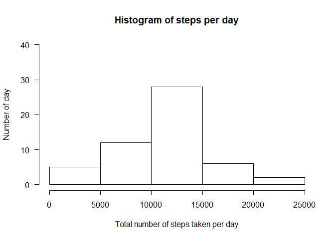
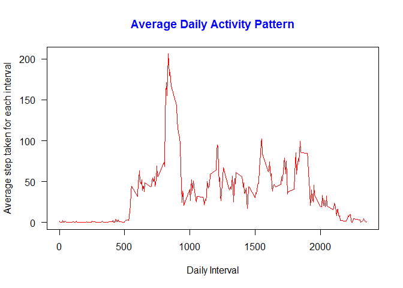
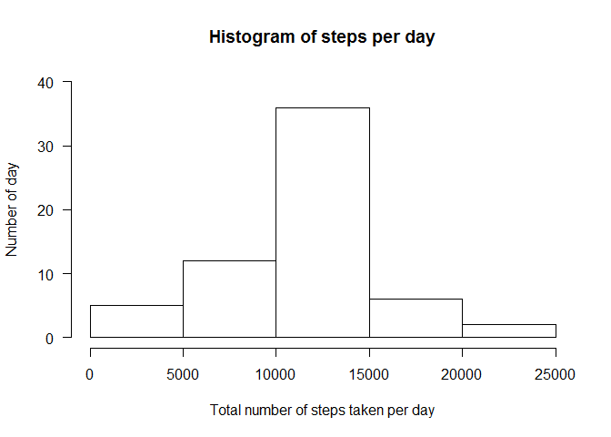
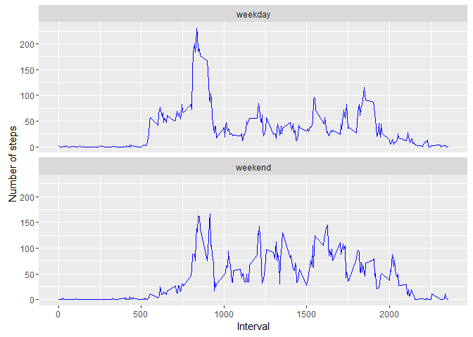

Reproducible Research Peer Graded Assignment: Course Project 1
==============================================================

Preparation of R environment


```r
library(knitr)
```

```
## Warning: package 'knitr' was built under R version 3.3.1
```

```r
library(ggplot2)
```

```
## Warning: package 'ggplot2' was built under R version 3.3.1
```

```r
opts_chunk$set(echo = TRUE)
```

Loading data from excel file


```r
data <- read.csv("activity.csv",header=TRUE,sep=",",colClasses=c("numeric","character","numeric"))
data$date = as.Date(data$date,format="%Y-%m-%d")
data$interval=as.factor(data$interval)
```

Question 1: What is mean total number of steps taken per day?

```r
data_valid <-data[complete.cases(data),]
steps_daily <-aggregate(steps~date,data_valid,sum)
hist(steps_daily$steps, 
    main = "Histogram of steps per day",
    xlab = "Total number of steps taken per day",
    ylab = "Number of day",
    las = 1,
    ylim = c(0,40))
```

<!-- -->

```r
mean_steps <- mean(steps_daily$steps)
median_steps <- median(steps_daily$steps)
mean_steps = round(mean_steps,3)
mean_steps = as.character(mean_steps)
median_steps = as.character(median_steps)
```
The mean of the total number of steps taken per day is 10766.189 and median of the total number of steps taken per day is 10765.

Question 2: What is the average daily activity pattern?

```r
steps_interval <- aggregate(data_valid$steps,list(interval=data_valid$interval),mean)
steps_interval$interval <- as.character(steps_interval$interval)
plot(steps_interval$interval, 
     steps_interval$x, 
     type = "l", 
     las = 1, 
     col = "red", 
     main = "Average Daily Activity Pattern",
     col.main = "blue",
     xlab = "Daily Interval",
     ylab = "Average step taken for each interval")
```

<!-- -->

```r
max <- steps_interval[which.max(steps_interval$x), ]
max_interval <- max$interval
max_step <- max$x
max_step <- round(max_step,3)
```
The highest average number of steps was found in the 835th interval, which has the maximum steps of 206.17 steps.

Question 3:Imputing missing values

```r
na_missing = nrow(data)-nrow(data_valid)
```
The total number of missing values in the dataset is 2304.

```r
for(i in which(is.na(data$steps))) {
    int <- data$interval[i]
    data_replace <- steps_interval[which(steps_interval$interval == int), ]$x
    data$steps[i] <- data_replace
}
data_final <- data.frame(steps=data$steps,date = data$date,interval = data$interval)
final_steps_daily <-aggregate(steps~date,data_final,sum)
hist(final_steps_daily$steps, 
    main = "Histogram of steps per day",
    xlab = "Total number of steps taken per day",
    ylab = "Number of day",
    las = 1,
    ylim = c(0,40))
```

<!-- -->

```r
final_mean_steps <- mean(final_steps_daily$steps)
final_median_steps <- median(final_steps_daily$steps)
final_mean_steps = round(final_mean_steps,3)
final_median_steps = round(final_median_steps,3)
final_mean_steps = as.character(final_mean_steps)
final_median_steps = as.character(final_median_steps)
```
The mean of the total number of steps taken per day is 10766.189 and median of the total number of steps taken per day is 10766.189.The mean remain unchanged however the median increases towards the mean value.The imputing of the missing data on the estimates of the total daily numbers of steps only impact the median, but does not affect the mean.

Question 4:Are there differences in activity patterns between weekdays and weekends?

```r
data_final$days <- ifelse(weekdays(data_final$date) %in% c("Saturday", "Sunday"), "weekend", "weekday")
data_final$days  <- as.factor(data_final$days)
data_final<- aggregate(steps ~ interval + days,data_final, mean)
data_final$interval <-as.integer(levels(data_final$interval)[data_final$interval])
ggplot(data_final, aes(interval,steps,group=1)) + 
        geom_line(color="blue") + 
        facet_wrap(~days, nrow=2, ncol=1) +
        labs(x="Interval", y="Number of steps")
```

<!-- -->
        


  
